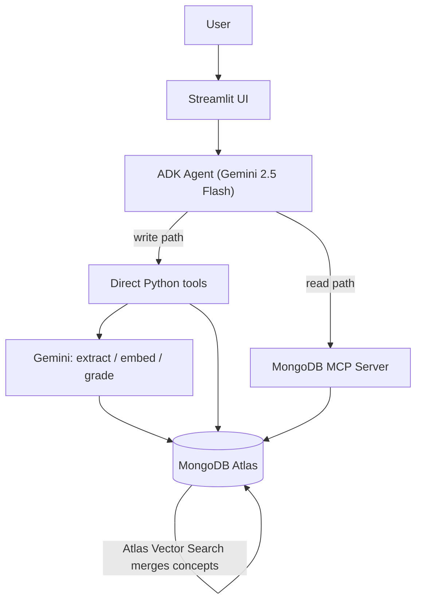

# Honeycomb

> Your evolving knowledge graph, built one source at a time.

[](https://honeycomb-agent-jpz3bblmwwytqhpkwwhvxu.streamlit.app)
[](LICENSE)
[](https://ai.google.dev)

**Live demo:** https://honeycomb-agent-jpz3bblmwwytqhpkwwhvxu.streamlit.app
**Repo:** https://github.com/vineetKverma/honeycomb-agent

## What makes Honeycomb different

AI quiz tools like Monic, Quizgecko, Mindgrasp, and Edpuzzle turn each video into an isolated flashcard deck. **Honeycomb builds one connected, mastery-tracked graph across everything you learn.** Three things make that real:

### 1. Cross-source merging — one graph, not N decks

When you ingest a new source, Honeycomb embeds each extracted concept and uses MongoDB Atlas Vector Search to decide whether it is the *same* idea you already learned elsewhere. Repeats become a single node with multiple sources, instead of duplicate cards. In our eval harness this separated genuine repeats from distinct ideas cleanly: **~86% merge rate for duplicates within a source, ~6% across unrelated sources** — it unifies what recurs without collapsing things that only look similar.

### 2. Prerequisite chains that span domains

Every concept stores its prerequisites, and edges are drawn whenever a prerequisite names a concept already in the graph — even one learned from a different video or subject. The result is a learning map you can trace backward ("what do I need first?"), not a flat list.

### 3. An agent that reasons over the whole graph

A 6-tool agent built on Google's ADK plans its steps out loud and queries the *entire* graph through the MongoDB MCP Server — counting, filtering, and aggregating across all your sources — then quizzes you and records mastery. It reasons over your knowledge, not a single deck.

## Screenshots

| Knowledge graph | Daily review | Quiz |
|---|---|---|
|  |  |  |

## How it works



## Architecture

- **Agent** — Google Cloud Agent Builder (ADK) orchestrating Gemini 2.5 Flash; 6 tools with a multi-step planning prompt.
- **Extraction & embeddings** — Gemini 2.5 Flash for structured concept extraction; `gemini-embedding-001` for 768-dim vectors.
- **Storage** — MongoDB Atlas: a `concepts` document collection plus an append-only `mastery_events` log.
- **Linking** — MongoDB Atlas Vector Search (cosine, 768-dim) with a name-normalization gate to merge duplicates instead of creating them.
- **Partner integration** — MongoDB MCP Server (stdio) gives the agent read-only `find` / `aggregate` / `count` / `list-collections` tools.
- **Frontend** — Streamlit (4 pages) on Streamlit Cloud; the knowledge-graph hero is rendered with `streamlit-agraph`, colored by mastery level.

## The agent: 6 tools and a sample mission

1. **`ingest_learning_source`** — fetch transcript, extract concepts, embed, and link into the graph.
2. **`quiz_concept`** — generate one understanding-focused question for a concept.
3. **`grade_my_answer`** — grade a free-text answer fairly and encouragingly.
4. **`record_quiz_attempt`** — append the outcome to the mastery event log.
5. **`daily_review`** — return the weakest / most-overdue concepts for spaced repetition.
6. **MongoDB MCP tools** — `find` / `aggregate` / `count` / `list-collections` for agent-mediated graph queries.

**Sample mission:** *"Ingest this 3Blue1Brown video, tell me where I'm weakest, and quiz me."*
The agent plans aloud, then chains: `ingest_learning_source` -> MCP `count` / `find` -> `daily_review` -> `quiz_concept` -> `grade_my_answer` -> `record_quiz_attempt`.

## Why MongoDB

- **Document model** fits concepts naturally — definition, prerequisites, sources, and embedding live in one document, no joins.
- **Atlas Vector Search** powers the core USP: new concepts link by semantic similarity, turning isolated notes into a connected graph.
- **MongoDB MCP Server** is the agent's database interface — safe, read-only DB access exposed as tools, in the agent's actual call path rather than bolted on.

## Local setup

```bash
git clone https://github.com/vineetKverma/honeycomb-agent.git
cd honeycomb-agent

python -m venv venv
# Windows
venv\Scripts\activate
# macOS / Linux
source venv/bin/activate

pip install -r requirements.txt
cp .env.example .env   # then fill in the values below
```

### Environment variables (`.env`)

| Variable | Description |
|---|---|
| `GEMINI_API_KEY` | Google AI Studio API key |
| `MONGODB_URI` | Atlas connection string |
| `MONGODB_DB` | Database name (e.g. `honeycomb`) |
| `MONGODB_COLLECTION` | Collection name (e.g. `concepts`) |
| `VECTOR_INDEX_NAME` | Atlas vector index name (e.g. `concept_vector_index`) |

### Atlas vector index

Create a Vector Search index named `concept_vector_index` on `honeycomb.concepts`:

```json
{
  "fields": [
    { "type": "vector", "path": "embedding", "numDimensions": 768, "similarity": "cosine" }
  ]
}
```

### Run

```bash
streamlit run app/streamlit_app.py      # the web app
python scripts/run_agent_cli.py         # the ADK agent in a local REPL
python scripts/test_mastery.py          # mastery logic test (zero Gemini quota)
```

## MongoDB MCP smoke test

The MCP server is a Node.js package. Install Node 18+, then:

```bash
npm install -g mongodb-mcp-server
python scripts/test_mongo_mcp.py
```

This spawns the server over stdio, runs the MCP `initialize` handshake, lists the tools, and reads one document back to prove an end-to-end agent -> MCP -> Atlas round trip.

## Project structure

```
honeycomb-agent/
├── agent/                 # ADK agent: tools, system prompt, MCP wiring
│   ├── agent.py
│   ├── tools.py
│   ├── system_prompt.py
│   └── mcp_config.json
├── app/                   # Streamlit UI (graph / ingest / review / mastery)
│   ├── streamlit_app.py
│   └── pages_*.py
├── scripts/               # smoke tests & utilities
├── data/                  # test source URLs
├── ingest.py              # transcript fetch
├── extract.py             # Gemini concept extraction
├── embed.py               # Gemini embeddings
├── link.py                # vector-search merge-or-create
├── quiz.py                # quiz generation + grading
├── mastery.py             # mastery + spaced repetition
├── pipeline.py            # ingest orchestration
├── db.py / config.py      # Atlas + settings
├── requirements.txt
└── runtime.txt
```

## Hackathon compliance

- [x] Multi-step agent on Google Cloud Agent Builder (ADK) — 6 tools, plans before acting
- [x] Powered by Gemini 2.5 Flash (reasoning, extraction, grading)
- [x] MongoDB Atlas as the data layer (documents + Vector Search)
- [x] MongoDB MCP Server partner integration in the agent's tool path
- [x] Publicly deployed live demo (Streamlit Cloud)
- [x] Public repository, MIT licensed

## Limitations

- **Hosted demo uses the direct DB path.** Streamlit Cloud cannot spawn the Node MCP subprocess, so the deployed app talks to Atlas directly via pymongo. The full MCP stack runs locally via the agent CLI (`scripts/run_agent_cli.py`) and `scripts/test_mongo_mcp.py`.
- **Free-tier Gemini quota** is ~20 requests/day on 2.5 Flash, so quizzing and ingesting are paced; production would move to Vertex AI.
- **Vector search** requires the Atlas index to be in `Active` status before linking works.

## What's next

- Ingest PDFs and articles, not just video transcripts.
- Multimodal: extract concepts from lecture slides and diagrams.
- A browser extension to add the page you're reading to your graph.
- Team mode: shared graphs and group mastery tracking.

## Acknowledgments

- Google Cloud Rapid Agent Hackathon and the MongoDB partner track.
- Google ADK + Gemini, and the MongoDB Atlas / MCP Server teams.
- `streamlit-agraph` for the visualization, and 3Blue1Brown, Crash Course, and MIT OpenCourseWare for excellent test content.

## License

Released under the MIT License — see [LICENSE](LICENSE).
